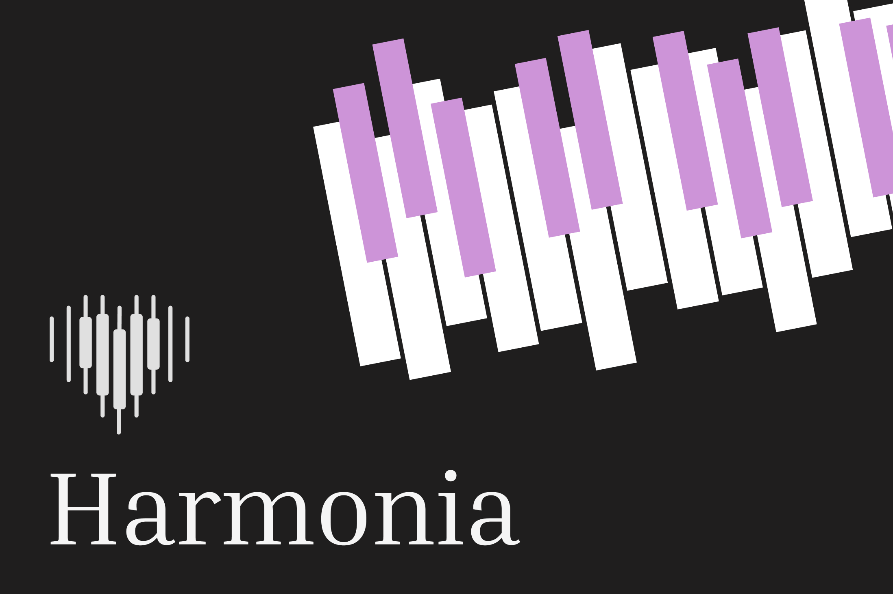

# 🎵 Harmonia

> A subconscious music training tool. Learn songs by ear, not by sheet music.

Built for **BearHack 2026** under the theme *Breaking the Norm*.



## The Idea

Most beginners hit a wall before the fun part of music: sheet music, note names, scales, theory.

Harmonia removes those layers and trains the ear directly. Some musicians can naturally play songs by ear; we wanted to see if that ability could be trained through repetition, real-time feedback, and carefully designed practice loops.

## How It Works

1. **Listen** to a short target from a song
2. **Play** what you hear on the virtual piano
3. **Adjust** using a spatial heatmap that shows pitch distance
4. **Advance** when your sound matches the target

No note names. No sheet music. No scores. No theory labels.
**The interaction is the teacher.**

## Features

- 🎹 Playable browser piano (keyboard and touch input)
- 🌈 Real-time WebGL heatmap visualizer with directional feedback
- 👐 Separate left-hand chord and right-hand melody practice modes
- 🔁 Adaptive progression that reintroduces earlier targets to reinforce memory
- 🎼 Currently trained on *Viva la Vida*
- 👁️ Toggle visualizer on or off as your ear improves

## Tech Stack

| Layer | Choice |
|-------|--------|
| Build | Vite |
| Language | Vanilla JavaScript |
| Audio | Web Audio API (no external libraries) |
| Visuals | WebGL with custom shaders |
| Backend | None, fully client-side |

## Run It Locally

```sh
cd visual
npm install
npm run dev
```

Build and preview:

```sh
npm run build
npm run preview
```

## Project Structure

```
visual/src/
├── main.js                              # Progression, evaluation, UI state
├── piano/mountPracticePiano.js          # Piano rendering + Web Audio synth
├── playground/mountDesignerPlayground.js  # Pitch-distance to visualizer bridge
├── webgl/
│   ├── GridRenderer.js                  # Heatmap rendering
│   └── shaders.js                       # WebGL shaders
└── data/vivaLaVidaSongNotes.js          # Song note data
```

## What We Tried

- **Microphone pitch detection.** Worked for single notes, but polyphonic detection was too noisy and environment-dependent for real-time use.
- **Computer vision** to track keys on a real piano. Too much setup and calibration overhead for a hackathon.
- **Virtual keyboard** (final). Direct note access, reliable feedback, and a clear path to MIDI support for real keyboards later.

## What We Learned

Ear-training interfaces live on a thin line between guidance and dependency. If feedback is too explicit, it becomes another form of notation. If it is too abstract, beginners cannot adjust. Getting the heatmap to feel directional without becoming prescriptive took many iterations.

Progression design matters too. Reintroducing earlier targets helps retention more than moving linearly through a song.

## What's Next

- Full songs with AI-driven segmentation into learnable chunks
- Adaptive difficulty based on user performance
- MIDI input for real keyboards
- Improved microphone-based polyphonic pitch detection
- Richer chord detection with multiple simultaneous indicators
- User-loaded songs and an expanding library

Long term, Harmonia aims to make relative pitch a primary pathway into music, the foundation beginners start with rather than a skill they develop later.

## The Team

Built with love, sweat, and tears at BearHack 2026.

- Karina
- Celine
- Gaya
- Montrey